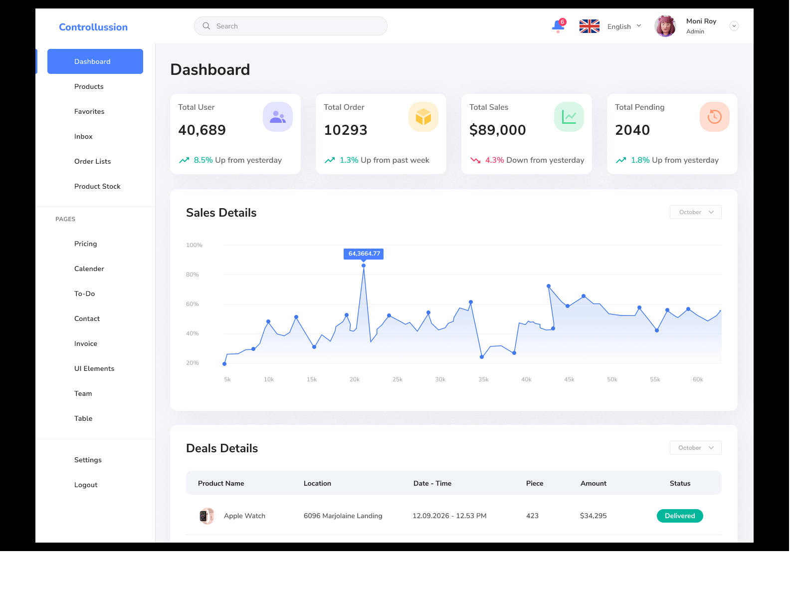

# Controllusion CRM

Controllusion is a full-stack CRM application built as a monorepo with a React frontend and a Spring Boot backend. The project is focused on a clean college-final scope: authentication, dashboard metrics, customer management, profile editing, and admin user management.

This repository is structured for real deployment:
- `frontend` -> Vercel-ready React + Vite SPA
- `backend` -> Render-ready Spring Boot + PostgreSQL API

## Preview



## Core Features

- JWT authentication with login, registration, session restore, and logout
- Protected routes and role-based admin access
- Dashboard with backend-powered summary metrics
- Customer CRUD with search, filter, sort, and detail view
- Profile update and password change
- Admin user listing, invite/create flow, role updates, and enable/disable actions
- Validation, loading states, empty states, and error states
- Swagger UI for API testing
- PostgreSQL persistence with Flyway migrations and seed data

## Monorepo Structure

```text
crm/
  frontend/
  backend/
```

### Frontend

```text
frontend/
  public/
  src/
    components/
    context/
    hooks/
    layouts/
    pages/
    routes/
    services/
    utils/
  package.json
  vite.config.js
  vercel.json
```

### Backend

```text
backend/
  pom.xml
  src/main/java/com/controllusion/backend/
    config/
    controller/
    dto/
    entity/
    exception/
    mapper/
    repository/
    security/
    service/
  src/main/java/db/migration/
    V2__seed_demo_data.java
  src/main/resources/
    application.yml
    db/migration/
      V1__create_schema.sql
```

## Tech Stack

| Layer | Stack |
| --- | --- |
| Frontend | React 18, Vite, React Router DOM, Tailwind CSS, Axios, Recharts |
| Backend | Java 21, Spring Boot 4, Spring Web, Spring Data JPA, Spring Security, JWT |
| Database | PostgreSQL |
| Migrations | Flyway |
| API Docs | springdoc-openapi / Swagger UI |
| Deployment | Vercel frontend, Render backend |

## Product Routes

### Public

- `/`
- `/login`
- `/register`

### Protected

- `/dashboard`
- `/customers`
- `/customers/create`
- `/customers/:id`
- `/customers/:id/edit`
- `/profile`

### Admin Only

- `/admin`

### Fallback

- `*`

## API Endpoints

All backend routes are served under `/api`.

### Auth

- `POST /api/auth/login`
- `POST /api/auth/register`
- `GET /api/auth/me`
- `PATCH /api/auth/profile`
- `POST /api/auth/change-password`
- `POST /api/auth/logout`

### Dashboard

- `GET /api/dashboard/summary`

### Customers

- `GET /api/customers`
- `GET /api/customers/{id}`
- `POST /api/customers`
- `PATCH /api/customers/{id}`
- `DELETE /api/customers/{id}`

### Admin Users

- `GET /api/users`
- `POST /api/users/invite`
- `PATCH /api/users/{id}`

## Demo Accounts

Seeded by Flyway on first backend startup:

| Role | Email | Password |
| --- | --- | --- |
| Admin | `admin@controllusion.com` | `Admin@123` |
| User | `sara@controllusion.com` | `User@1234` |

Users invited from the admin panel receive the temporary password from `INVITE_TEMP_PASSWORD`, which defaults to `Welcome@123`.

## Local Development

### Requirements

- Node.js 18+
- npm
- Java 21
- Maven
- PostgreSQL

### 1. Create the Database

Create a PostgreSQL database, for example:

```sql
CREATE DATABASE controllusion;
```

### 2. Run the Backend

From the repo root:

```bash
cd backend
mvn spring-boot:run
```

Default backend URL:

```text
http://localhost:8080
```

Swagger UI:

```text
http://localhost:8080/swagger-ui.html
```

### 3. Run the Frontend

From the repo root:

```bash
cd frontend
npm install
```

Create `.env` from `.env.example`:

```bash
VITE_API_BASE_URL=http://localhost:8080/api
VITE_API_PROXY_TARGET=http://localhost:8080
```

Then run:

```bash
npm run dev
```

Default frontend URL:

```text
http://localhost:5173
```

## Environment Variables

### Frontend

| Variable | Purpose | Example |
| --- | --- | --- |
| `VITE_API_BASE_URL` | Base URL for frontend API requests | `http://localhost:8080/api` |
| `VITE_API_PROXY_TARGET` | Local dev proxy target | `http://localhost:8080` |

### Backend

| Variable | Purpose | Example |
| --- | --- | --- |
| `PORT` | Backend server port | `8080` |
| `JDBC_DATABASE_URL` or `DB_URL` | PostgreSQL JDBC URL | `jdbc:postgresql://localhost:5432/controllusion` |
| `JDBC_DATABASE_USERNAME` or `DB_USERNAME` | Database username | `postgres` |
| `JDBC_DATABASE_PASSWORD` or `DB_PASSWORD` | Database password | `postgres` |
| `JWT_SECRET` | JWT signing secret | `your-long-random-secret` |
| `JWT_EXPIRATION_MINUTES` | Token lifetime | `1440` |
| `APP_CORS_ALLOWED_ORIGINS` | Allowed frontend origins | `http://localhost:5173,https://your-app.vercel.app` |
| `INVITE_TEMP_PASSWORD` | Temporary password for invited users | `Welcome@123` |
| `DB_MAX_POOL_SIZE` | Hikari pool size | `10` |

## Database Schema

### `users`

- `id`
- `full_name`
- `email`
- `password_hash`
- `role`
- `active`
- `title`
- `phone`
- `theme_preference`
- `created_at`
- `updated_at`

### `customers`

- `id`
- `owner_id`
- `full_name`
- `email`
- `phone`
- `company`
- `job_title`
- `status`
- `stage`
- `deal_value`
- `notes`
- `location`
- `industry`
- `last_contacted_at`
- `created_at`
- `updated_at`

## Migrations and Seed Data

### Flyway Migrations

- `V1__create_schema.sql`
  Creates the database schema.
- `V2__seed_demo_data.java`
  Seeds admin/user accounts and realistic customer records with BCrypt-hashed passwords.

### Seeded Customers

The backend seeds demo-ready customer records across multiple pipeline states such as:

- `Lead`
- `Qualified`
- `Proposal`
- `Negotiation`
- `Won`
- `Lost`

This makes the dashboard, list, filters, and detail pages usable immediately after first startup.

## Authentication and Security

- Passwords are hashed with BCrypt
- JWT bearer tokens are returned on login and register
- The frontend stores the token in browser session data and sends it in the `Authorization` header
- `/api/users/**` is admin-only
- All non-public CRM endpoints require authentication
- CORS is configurable for localhost and deployed frontend origins

## Frontend Notes

- Axios is configured with an env-based base URL
- React Router handles protected and role-based routes
- Customer list supports client-side search, filter, sort, and pagination on top of backend data
- UI includes reusable cards, buttons, table, modal, loading, empty, and error components

## Deployment

### Frontend -> Vercel

- Project root: `frontend`
- Build command: `npm run build`
- Output directory: `dist`
- Set:
  - `VITE_API_BASE_URL=https://your-render-backend.onrender.com/api`
- `frontend/vercel.json` already contains SPA rewrites

### Backend -> Render

- Project root: `backend`
- Build command:

```bash
mvn clean package -DskipTests
```

- Start command:

```bash
java -jar target/backend-1.0.0.jar
```

- Provision PostgreSQL in Render
- Set backend environment variables for DB, JWT, and CORS
- Add the Vercel frontend URL to `APP_CORS_ALLOWED_ORIGINS`

## College Rubric Alignment

This project now clearly covers:

- React SPA with multiple pages
- React Router with dynamic and protected routes
- authentication logic
- API integration
- create/edit/delete customer functionality
- forms and validation
- loading, empty, and error states
- profile management
- admin panel
- production-ready monorepo structure
- public deployment path via Vercel + Render

## Notes

- `screenshots/` is not part of the application runtime
- The backend is the source of truth for users and customers
- The old mock `localStorage`-only architecture has been replaced by a real API-backed structure for core CRM data
